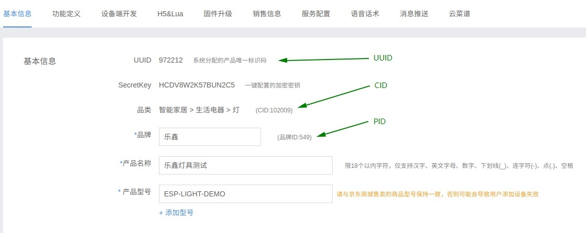
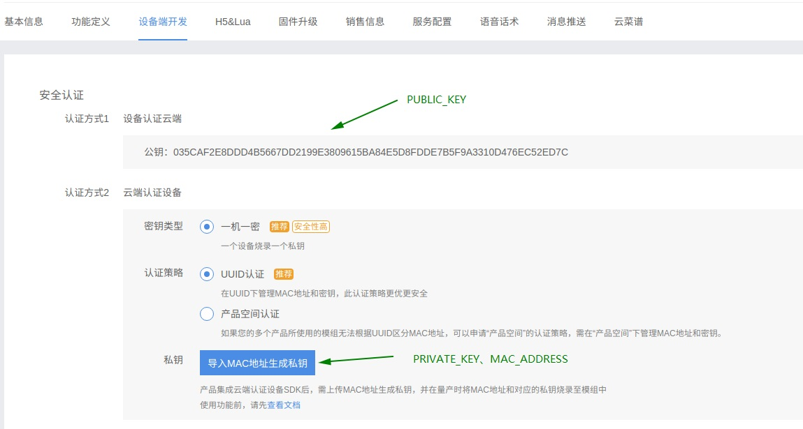
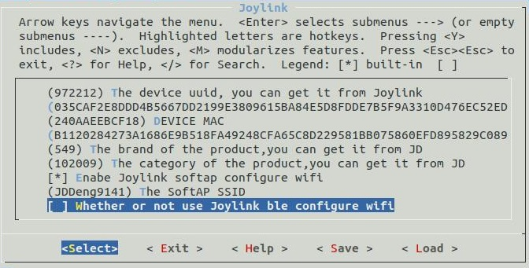
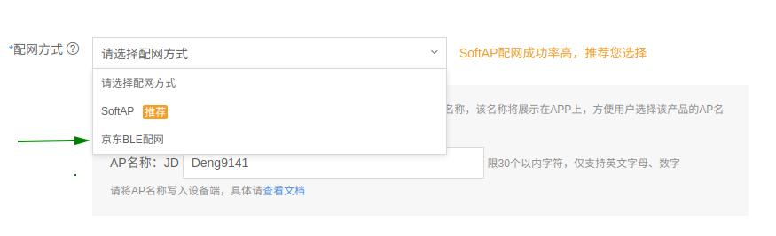

## 章节介绍：

* **1. 概述：** 介绍背景。
* **2. Demo 使用：** 介绍 Demo 如何跑起来。包括环境搭建，编译下载，设备控制。
* **3. 开发指南：** 介绍 Demo 如何二次开发。包括文件结构，功能介绍，API介绍，资源占用。
* **4. 相关链接：** 给出与 joylink 相关的链接。包括 Demo 下载，微联文档。

## 1. 概述
ESP 平台实现了京东微联 Joylink2.1.22 协议。用户可以参考 Espressif 提供的设备端 Demo 进行二次开发，快速接入京东微联云平台。

Demo 参考京东官方 [Joylink2.1.22 SDK](https://smartdev.jd.com/docCenterDownload/list/2)，添加了 WiFi 相关、OTA、Flash 存储等适配层，用户只需要关心少部分 API，如初始化、数据收发、事件回调等，加快了用户的二次开发速度。适配层具有一定的通用性且开源，用户可根据产品需求自行修改。
Demo 使用的通讯方式为非透传模式。非透传模式下需要在开发者中心上传空实现的 lua 脚本： `only_trans.lua`。

目前京东微联已经停止支持 SmartConfig 的配网方式，所以 Demo 中删除 SmartConfig 配网，目前支持 SoftAp 和 Thunder 配网，芯片上电默认进入 SoftAP 配网，如果用户需要使用 Thunder 配网，需要购买京东的音箱，音箱需要进入沙箱模式，与音箱相关的设置，用户可以咨询京东。

## 2. Demo 使用
用户拿到乐鑫提供的 esp-joylink 后，根据不同的 example 编译下载固件到乐鑫 ESP8266 、 ESP32 或者 ESP32-S 系列和 ESP32-C 系列开发板或模组。使用京东微联 APP 扫描测试设备的二维码进行配置。配置激活成功后便可进行设备控制。此 Demo 对应的测试设备类型为“智能家居 / 生活电器 / 灯具”。

### 2.1. 环境搭建

* 环境准备
  * **ESP32**：[开发环境准备](https://docs.espressif.com/projects/esp-idf/en/stable/get-started/)
  * **ESP32-S2**：[开发环境准备](https://docs.espressif.com/projects/esp-idf/en/latest/esp32s2/get-started/index.html)
  * **ESP8266**：[开发环境准备](https://github.com/espressif/ESP8266_RTOS_SDK/blob/release/v3.0/docs/en/get-started/get-started-devkitc.rst)
  * **ESP32-S3**：[开发环境准备](https://docs.espressif.com/projects/esp-idf/en/latest/esp32s3/get-started/index.html)
  * **ESP32-C3**：[开发环境准备](https://docs.espressif.com/projects/esp-idf/en/latest/esp32c3/get-started/index.html)
  
* 硬件准备  
  * **开发板**：ESP8266 、ESP32、ESP32-S 系列或 ESP32-C 系列开发板
  * **路由器**：使用 2.4GHz 网络，可以连接外网
  * **手机**：安装[京东微联沙箱 APP](https://smartdev.jd.com/docCenterDownload/list/2)

* 软件准备
  
* **Demo下载**：下载 Demo 工程 [esp-joylink](https://github.com/espressif/esp-joylink.git)
  
* Demo 的网络拓扑结构

    

### 2.2 编译下载

* 工程编译
    首先设置  `IDF_PATH`  的路径

    * ESP8266 平台，请使用 ESP8266_RTOS_SDK release/v3.3 或 release/v3.4 分支
    * ESP32 平台， 请使用 ESP-IDF release/v4.2、release/v4.3 或 release/v4.4 分支
    * ESP32-S2 平台，请使用 ESP-IDF release/v4.2、release/v4.3 或 release/v4.4 分支
    * ESP32-S3 平台，请使用 ESP-IDF release/v4.4 分支
    * ESP32-C3 平台，请使用 ESP-IDF release/v4.3 或 release/v4.4 分支

    然后在 menuconfig 里面配置 joylink 相关参数 `UUID`，`CID`，`PID`， `PUBLIC_KEY`，`PRIVATE_KEY`，`MAC_ADDRESS`，其中 `UUID`、`CID` 和 `PID` 分别代表产品的唯一标识码、品类和品牌，在云端产品中的位置如下
    
    
    
    `PUBLIC_KEY ` 为产品公钥，显示在设备端开发页面，设备认证采用一机一密的方式 ，用户需导入 `MAC_ADDRESS` (设备 MAC 地址) 来生成 `PRIVATE_KEY` (设备私钥) ，具体生成方式请在设备端开发页面点击 “导入 MAC 地址生成私钥” 选项并按提示进行。
    
    
    
    以light_demo为例，我们提供了默认的sdkconfig.defaults及partiton table文件（light_demo/default_configs目录下），用户可根据芯片不同，进行使用和参考。
    
    进入example/light_demo目录，然后输入命令 `$IDF_PATH/tools/idf.py build`， 编译工程。对于 ESP32-S2 平台，执行 `build`  命令之前应先执行`$IDF_PATH/tools/idf.py set-target esp32s2 ` 命令，切换为 ESP32-S2 的编译环境，之后再 `$IDF_PATH/tools/idf.py build`  编译工程。同样对于 ESP32-S3 和 ESP32-C3 平台，也需要在执行 `build`  命令之前执行 ESP32-S2 平台相类似的命令。
    
    (如果使用 ESP8266_RTOS_SDK v3.2，请使用 `make`  命令进行编译工程)

* 固件烧写  
    1. 如果没有安装串口驱动，需要先安装[串口驱动](http://www.usb-drivers.org/ft232r-usb-uart-driver.html)。
    2. 输入命令 `$IDF_PATH/tools/idf.py -p PORT flash`  (ESP8266_RTOS_SDK v3.2 使用 `make flash ESPPORT=PORT` ) ，将编译好的 bin 文件烧录到开发板中，`PORT`  选择和配置请参考[文档说明](https://docs.espressif.com/projects/esp-idf/en/stable/get-started/index.html#step-6-connect-your-device)。

对于ESP32、ESP32-S3 和 ESP32-C3 平台，Demo中包含两种配网方式: SoftAP 配网和 BLE 配网，可在 menuconfig 的 joylink 组件配置中进行选择切换，默认是使用SoftAP 配网

若切换 BLE 配网，首先需使能  `Whether or not use Joylink ble configure wifi` 选项，然后要在云端产品的基本信息页面中选择 "京东BLE配网" 并保存，最后重新编译和烧写后方可使用。

## 3. 开发指南
本章详细介绍 Demo 工程，如需二次开发请关注本章。
用户需要调用的 API 和参数配置相关的头文件在 `port/include/esp_joylink.h` 中。

### 3.1 文件结构

    .
    ├── CMakeLists.txt
    ├── component.mk
    ├── docs
    │   ├── md                                            //  md files
    │   │   └── 量产说明.md
    │   └── _picture
    │
    ├── config
    │   └── mass_mfg
    │       ├── multipule_mfg_config.csv
    │       ├── multipule_mfg_values.csv
    │       └── single_mfg_config.csv
    │   
    ├── examples
    │   ├── light_demo                                    //  light_demo
    │   │   ├── CMakeLists.txt
    │   │   ├── components
    │   │   ├── default_configs                           // default sdkconfigs
    │   │   ├── main
    │   │   ├── README.md
    │   │   └── Makefile
    │   └── transparent_transmission
    │   
    ├── joylink_dev_sdk                                   // joylink SDK source code
    │   ├── ble_sdk
    │   ├── example
    │   ├── joylink
    │   ├── lua
    │   ├── Makefile
    │   ├── pal
    │   ├── README
    │   └── scripts
    │       
    ├── Kconfig
    ├── port                                              // joylink SDK adaptation
    │   ├── include
    │   ├── joylink_ble.c
    │   └── joylink_upgrade.c
    │
    └── README.md

### 3.2 参数配置

* 产品信息配置  
    在 `memuconfig` 中， 用户可以修改以下这些参数，如 AES_KEY, UUID, PID等，系统会调用 `joylink_dev_init()` 传入产品注册的信息，注册事件回调函数。用户如果需要修改为自己的设备，首先需要在京东开发者中心上申请自己的设备，并根据相应设备信息在此处修改。  
    因为这些参数需要在服务器后台产品基本信息里获取，或者向京东有关部门咨询。

### 3.3 配网
京东配网方式目前主推 SoftAP(自主激活), Demo 中同时支持 SoftAP(自主激活+代理激活)、Thunder 配网, 默认设置是进入 SoftAP 自主激活, 如果需要代理激活，可以在 Makefile 中将自主激活的宏关闭。

### 3.4 固件升级
实现固件升级需要上传新的固件到服务器后台。并填写正确的版本信息。
**注意**： 厂商必须严格按照固定格式填写版本号，如（1.1.1.20151020_release）。
如下图，后台设置在线升级界面。序号是上传 bin 文件后自动生成的。设备端上传的 version 如果与这个版本号不同， APP 会自动推送 OTA 的提示。

### 3.5量产功能

每台设备对应唯一的UUID、DeviceMAC、PrivateKey，用户除了可以在`menuconfig`配置相关参数信息，也可以通过烧录NVS分区的方式进行量产。

具体请参考[量产说明](docs/md/量产说明.md)

>如果执行了`idf.py erase_flash`, 需要重新烧录三元组

## 4. 相关链接

* Espressif 官网： http://espressif.com
* ESP32 SDK 下载： https://github.com/espressif/esp-idf
* ESP8266 SDK 下载： https://github.com/espressif/ESP8266_RTOS_SDK
* 烧录工具：http://espressif.com/en/support/download/other-tools
* 京东微联官网：https://smartcloud.jd.com
* 官方JoyLink协议SDK： https://storage.jd.com/testsmartcloud/joylink_dev_sdk.zip
* 设备入网的协议文档： https://storage.jd.com/testsmartcloud/JoylinkConfigDoc.zip
