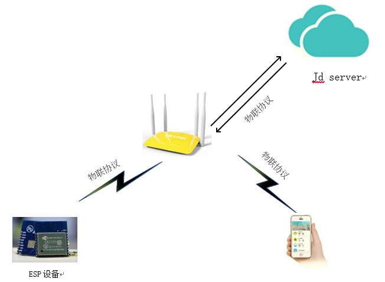
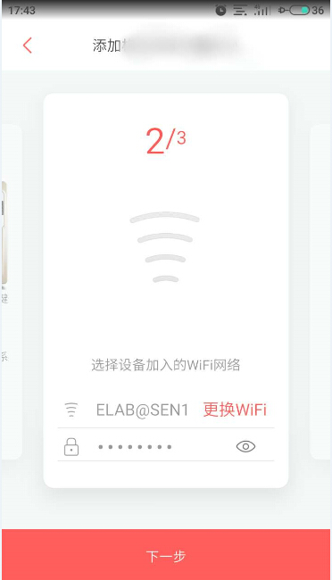
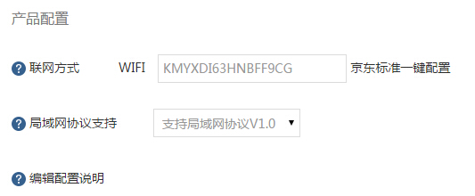
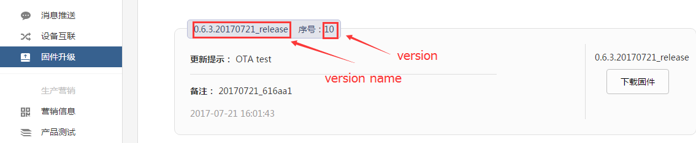

## 章节介绍：

* **1. 概述：** 介绍背景。
* **2. Demo 使用：** 介绍 Demo 如何跑起来。包括环境搭建，编译下载，设备控制。
* **3. 开发指南：** 介绍 Demo 如何二次开发。包括文件结构，功能介绍，API介绍，资源占用。
* **4. 相关链接：** 给出与 joylink 相关的链接。包括 Demo 下载，微联文档。

## 1. 概述
ESP 平台实现了京东微联 Joylink2.0.15 协议。用户可以参考 Espressif 提供的设备端 Demo 进行二次开发，快速接入京东微联云平台。

Demo 参考京东官方 [Joylink2.0.15 SDK](https://smartdev.jd.com/docCenterDownload/list/2)，添加了 WiFi 相关、OTA、Flash 存储、button 等适配层，用户只需要关心少部分 API，如初始化、数据收发、事件回调等，加快了用户的二次开发速度。适配层具有一定的通用性且开源，用户可根据产品需求自行修改。
Demo 使用的通讯方式为非透传模式。非透传模式下需要在开发者中心上传空实现的 lua 脚本： `only_trans.lua`。

## 2. Demo 使用
用户拿到乐鑫提供 Joylink Demo 后，编译下载固件到乐鑫 ESP8266 或者 ESP32 开发板。使用京东微联 APP 扫描测试设备的二维码进行配置。配置激活成功后便可进行设备控制。此 Demo 对应的测试设备类型为“智能家居 / 生活电器 / 灯具”。

### 2.1. 环境搭建

* 环境准备
  * **ESP32**：[开发环境准备](https://docs.espressif.com/projects/esp-idf/en/stable/get-started/)
  * **ESP8266**：[开发环境准备](https://github.com/espressif/ESP8266_RTOS_SDK/blob/release/v3.0/docs/en/get-started/get-started-devkitc.rst)

* 硬件准备  
  * **开发板**：ESP8266 与 ESP32 开发板（[ESP-DevKitC](http://espressif.com/zh-hans/company/contact/buy-a-sample)）
  * **路由器**：使用 2.4GHz 网络，可以连接外网
  * **手机**：安装[京东微联沙箱 APP](https://smartdev.jd.com/docCenterDownload/list/2)

* 软件准备
  * **Demo下载**：下载 Demo 工程 [esp-joylink](https://github.com/espressif/esp-joylink.git)

* Demo 的网络拓扑结构

    

### 2.2 编译下载

* 工程编译
    首先设置 `IDF_PATH` 的路径，如果是 ESP8266，请使用 ESP8266_RTOS_SDK v3.1, 如果是 ESP32， 则选择 ESP-IDF v3.0

    然后在menuconfig里面配置joylink相关参数 `UUID`, `CID`, `PID`, `PUBLIC_KEY`,`PRIVATE_KEY`,`MAC_ADDRESS`.

    最后再输入命令 `make`， 编译工程。

* 固件烧写  
    1. 如果没有安装串口驱动，需要先安装[串口驱动](http://www.usb-drivers.org/ft232r-usb-uart-driver.html)。
    2. 输入命令 `make flash`， 将编译好的 bin 文件烧录到开发版中。

### 2.3 运行

* 操作步骤  

    |序号|设备|状态灯|APP|  
    | :---- | :---- | :----- | :------ |
    |1|上电，串口正常打印|不亮|-|  
    |2|配网按键，进入配网|慢闪|扫码开始配置|  
    |3|配网成功，连接服务器|快闪|显示可使用设备|  
    |4|连接服务器成功|常亮|显示设备控制界面|  
    |5|设备被控时状态灯会显示|亮灭|控制设备状态|  


* 扫描二维码

    

* 配网界面

    

## 3. 开发指南
本章详细介绍 Demo 工程，如需二次开发请关注本章。
用户需要调用的 API 和参数配置相关的头文件在 `port/include/esp_joylink.h` 中。
### 3.1 文件结构

    ├── examples
    │    └── light_demo                         // light demo
    │       ├── Makefile
    │       ├── README.md
    │       ├── button
    │       ├── main
    │       │   ├── Kconfig
    │       │   ├── app_main.c
    │       │   └── component.mk
    │       └── sdkconfig.defaults
    ├── joylink_cloud                           // joylink SDK source code
    │    ├── docs
    │    ├── joylink_ble
    │    ├── joylink_dev_sdk
    │    ├── joylink_smnt_v3.0.11
    │    └── joylink_softap
    ├── port                                    // joylink SDK adaptation
    │    ├── app
    │    ├── ble
    │    ├── extern
    │    ├── include
    │    ├── jdinnet
    │    └── softap
    ├── component.mk
    ├── docs
    └── README.md

### 3.2 参数配置

* 产品信息配置  
    在 `/port/extern` 中， 用户可以修改以下这些参数，如 AES_KEY, UUID, PID等，系统会调用 `joylink_dev_init()` 传入产品注册的信息，注册事件回调函数。用户如果需要修改为自己的设备，首先需要在京东开发者中心上申请自己的设备，并根据相应设备信息在此处修改。  
    因为这些参数需要在服务器后台产品基本信息里获取，或者向京东有关部门咨询。

### 3.3 配网
京东一键配置方式包括：BLE 配网，京豆标准一键配置，京豆标准一键配置+SoftAp。Demo 中使用的配网方式为京东标准一键配置，后台填写的联网方式代码为 ```KMYXDI63HNBFF9CG``` ， 如需其他配网方式代码请咨询京东。



### 3.4 固件升级
实现固件升级需要上传新的固件到服务器后台。并填写正确的版本信息。
**注意**： 厂商必须严格按照固定格式填写版本号，如（1.1.1.20151020_release）。
如下图，后台设置在线升级界面。序号是上传 bin 文件后自动生成的。设备端上传的 version 如果与这个版本号不同， APP 会自动推送 OTA 的提示。



### 3.5 辅助功能
增加了按键重启，与 led 状态指示功能。用户可以修改宏使能。

## 4. 相关链接
* Espressif 官网： http://espressif.com
* ESP32 SDK 下载： https://github.com/espressif/esp-idf
* ESP8266 SDK 下载： https://github.com/espressif/ESP8266_RTOS_SDK
* 烧录工具：http://espressif.com/en/support/download/other-tools
* 京东微联官网：https://smartcloud.jd.com
* 官方JoyLink协议SDK： https://storage.jd.com/testsmartcloud/joylink_dev_sdk.zip
* 设备入网的协议文档： https://storage.jd.com/testsmartcloud/JoylinkConfigDoc.zip
