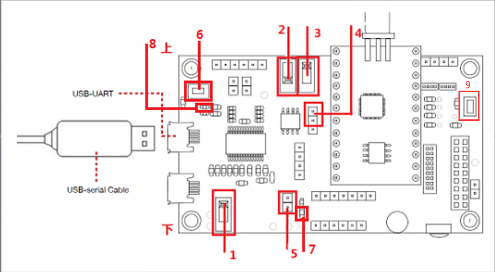
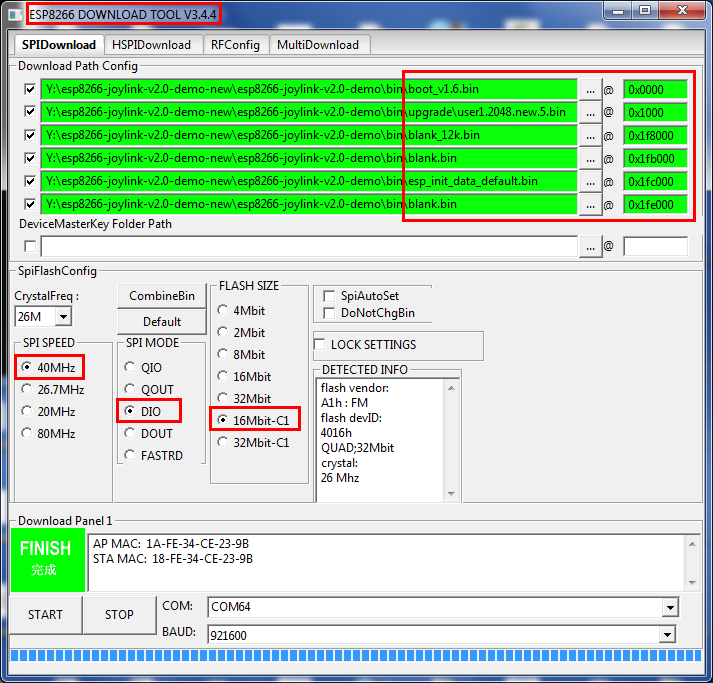

## 1. 概述
ESP8266 平台实现了京东微联 Joylink2.0 协议。用户可以参考 Espressif 提供的设备端 Demo 进行二次开发，快速接入京东微联云平台。

Demo 参考京东官方 [Joylink2.0 SDK](https://smartdev.jd.com/docCenterDownload/list/2)，添加了 WiFi 相关、OTA、Flash 存储、button 等适配层，用户只需要关心少部分 API，如初始化、数据收发、事件回调等，加快了用户的二次开发速度。适配层具有一定的通用性且开源，用户可根据产品需求自行修改。
Demo 使用的通讯方式为非透传模式。非透传模式下需要在开发者中心上传空实现的 lua 脚本： `only_trans.lua`。

本文档章节介绍：

* **1. 概述：** 介绍背景。
* **2. Demo 使用：** 介绍 Demo 如何跑起来。包括环境搭建，编译下载，设备控制。
* **3. 开发指南：** 介绍 Demo 如何二次开发。包括文件结构，功能介绍，API介绍，资源占用。
* **4. 相关链接：** 给出与 joylink 相关的链接。包括 Demo 下载，微联文档。

## 2. Demo 使用
用户拿到乐鑫提供 Joylink2.0 Demo 后，编译下载固件到乐鑫 ESP8266 开发板。使用京东微联 APP 扫描测试设备的二维码进行配置。配置激活成功后便可进行设备控制。此 Demo 对应的测试设备类型为“智能家居 / 生活电器 / 灯具”。

### 2.1. 环境搭建

* 硬件准备  
  * **开发板**：ESP8266 开发板（[ESP-LAUNCHER](http://espressif.com/zh-hans/company/contact/buy-a-sample)）
  * **路由器**：使用 2.4GHz 网络，可以连接外网
  * **手机**：安装[京东微联沙箱 APP](https://smartdev.jd.com/docCenterDownload/list/2)

* 开发板介绍

    
    
    标号 1 开关拨下（拨下为断电状态，拨上为上电状态）；  
    标号 2 开关拨下（拨下为下载模式，拨上为运行模式）；  
    标号 3 开关拨上（CHIP_EN PIN，默认拨上即可）；  
    标号 4 跳线帽插入上方的两个针脚；  
    标号 5 插入跳线帽，3.3v 供电；  
    标号 6 配网开关，设备进入配网模式；  
    标号 7 状态指示灯，设备配网慢闪->连接服务器快闪->联网成功常亮->控制成功状态改变；  
    标号 9 出厂设置开关，设备端会解绑并恢复出厂设置；  
    标号 10 连接 GPIO14 与 SW2 旁边的 J70，使能 SW2 按键，即出厂设置开关。  

* 环境拓扑结构

    

### 2.2 编译下载

* 编译环境的搭建  
    您可以使用 xcc 和 gcc 来编译项目，建议使用 gcc。对于 gcc，请参考[esp-open-sdk](https://github.com/pfalcon/esp-open-sdk)。

* 编译  
    如果您是在 ubuntu 的平台下开发只需运行脚本 `gen_misc.sh`，其他平台的参见：https://github.com/pfalcon/esp-open-sdk 

* 固件烧写  
    1. 安装[串口驱动](http://www.usb-drivers.org/ft232r-usb-uart-driver.html)  
    2. 安装[烧写工具](http://espressif.com/en/support/download/other-tools)
    3. 烧录相关 bin 文件，ESP8266 开发板中标号 2 开关拨下，进入下载模式，标号 1 拨上，给开发板上电。  
    4. 烧写设置为：  
        

            boot.bin------------------->0x000000    // 启动程序
            user1.2048.new.5.bin------->0x01000     // 主程序
            blank_12k.bin-------------->0x1F8000    // 初始化用户参数区
            blank.bin------------------>0x1FB000    // 初始化 RF_CAL 参数区。
            esp_init_data_default.bin-->0x1FC000    // 初始化其他射频参数区
            blank.bin------------------>0x1FE000    // 初始化系统参数区

        > 注：ESP-LAUNCHER 上的 J82 跳针需要用跳线帽短接，否则无法下载
    5. 固件烧写成功后，将 ESP8266 开发板标号 2 开关拨上，设置开发板为运行模式；将标号 1 开关拨上，给开发板上电。

### 2.3 运行

* 操作步骤  

    |序号|设备|状态灯|APP|  
    | :---- | :---- | :----- | :------ |
    |1|上电，串口正常打印|不亮|-|  
    |2|配网按键，进入配网|慢闪|扫码开始配置|  
    |3|配网成功，连接服务器|快闪|显示可使用设备|  
    |4|连接服务器成功|常亮|显示设备控制界面|  
    |5|设备被控时状态灯会显示|亮灭|控制设备状态|  


* 扫描二维码

    

* 配网界面

    

## 3. 开发指南
本章详细介绍 Demo 工程，如需二次开发请关注本章。
用户需要调用的 API 和参数配置相关的头文件在文件夹 `Demo/platforms/joylink/include` 中。
### 3.1 文件结构

    esp8266-joylink-v2.0
    ├── bin                                 // 存放生成的 bin 文件
    ├── docs                                // demo 使用文档的图片
    ├── driver                              // gpio 与 uart 等驱动
    ├── esp8266-rtos-sdk                    // ESP8266 SDK
    ├── gen_misc.sh                         // 编译脚本
    ├── include                             // 驱动相关头文件
    ├── Makefile                            // 通过 Makefile 来配置 JOYLINK 选项
    ├── platforms                           // 平台相关文件
    │   ├── joylink                         // joylink 相关 API
    │   │   ├── adaptation                  // joylink 的底层适配
    │   │   ├── application                 // joylink 应用层 API 的封装
    │   │   │   ├── esp_joylink.c           // joylink 数据传传输、连接 AP 、恢复出厂设置、事件回调函数等 API
    │   │   │   ├── esp_info_store.c        // Flash 的读写操作
    │   │   │   └── Makefile
    │   │   ├── include
    │   │   │   ├── esp_joylink.h           // 封装的应用层 API 使用说明及配置
    │   │   │   ├── esp_joylink_log.h       // 定义了打印等级
    │   │   │   └── esp_info_store.h        // 信息存储 API 详解及 EXAMPLE
    │   │   ├── Makefile
    │   │   └── README.md                        
    │   └── Makefile
    ├── utilities                           // 通用功能驱动
    │   ├── adapter                         // 通用功能适配
    │   ├── button                          // 按键功能驱动
    │   ├── status_led                      // 状态灯功能驱动                            
    │   ├── ringbuffer                      // ringbuffer 功能驱动
    │   └── Makefile
    ├── README.md                           // demo 使用文档
    └── user                                // 用户相关文件
        ├── only_trans.lua                  // 非透传模式需要上传的空实现 LUA 脚本
        ├── user_main.c                     // 用户程序入口
        ├── app_joylink.c                   // joylink 应用示例
        └── Makefile

### 3.2 参数配置
* 产品信息配置  
    在文件 `Demo/platforms/joylink/include/joylink_config.h` 中修改设备参数配置，系统会调用 `esp_joylink_init()` 传入产品注册的信息，注册事件回调函数。用户如果需要修改为自己的设备，首先需要在京东开发者中心上申请自己的设备，并根据相应设备信息在此处修改。  
    以下参数为产品信息，需要在服务器后台产品基本信息里获取，或者向京东有关部门咨询。  

    ```c
    #define JOYLINK_AES_KEY      "DNWXVNMPGRZB7DC5"     /*!< SecretKey，开发者中心获取 */
    #define JOYLINK_VERSION      1                      /*!< 固件版本，从1递增。需保证与服务器后台固件升级里设置的版本对应 */
    #define JOYLINK_ACCESSKEY    ""                     /*!< 激活过程产生 */
    #define JOYLINK_LOCAL_KEY    ""                     /*!< 激活过程产生 */
    #define JOYLINK_FEEDID       ""                     /*!< 激活过程产生 */
    #define JOYLINK_DEVTYPE      E_JLDEV_TYPE_NORMAL    /*!< 设备类型，向京东获取 */
    #define JOYLINK_SERVER       ""                     /*!< 激活过程产生 */
    #define JOYLINK_SERVER_PORT  2002                   /*!< 激活过程产生 */
    #define JOYLINK_BRAND        "38C4"                 /*!< 品牌，开发者中心获取 */
    #define JOYLINK_CID          "011c022b"             /*!< 设备品类码，向京东获取 */
    #define JOYLINK_FW_VERSION   "0.1.1"                /*!< 固件版本名称，需保证与服务器后台固件版本一直，固定格式，参考京东提供SDK文档 */
    #define JOYLINK_MODEL_CODE   "A2"                   /*!< 设备型号，开发者中心获取 */
    #define JOYLINK_UUID         "GNQIYS"               /*!< UUID，开发者中心获取 */
    #define JOYLINK_LAN_CTRL     E_LAN_CTRL_DISABLE     /*!< 设备是否支持局域网控制 */
    #define JOYLINK_CMD_TYPE     E_CMD_TYPE_JSON        /*!< 数据是json或者scirpt方式传输 */
    ```

* 工程参数配置  
    在文件 `Demo/platforms/joylink/include/esp_joylink.h` 中修改任务的优先级，队列个数，收发数据长度，任务栈空间，超时时间等参数。  

    ```c
    #ifndef CONFIG_JOYLINK_TASK_PRIOTY
    #define CONFIG_JOYLINK_TASK_PRIOTY    (2)           /*!< 任务基础优先级 */
    #endif
    
    #ifndef CONFIG_DOWN_CMD_QUEUE_NUM
    #define CONFIG_DOWN_CMD_QUEUE_NUM     (3)           /*!< 上报数据队列个数 */
    #endif
    
    #ifndef CONFIG_UP_CMD_QUEUE_NUM
    #define CONFIG_UP_CMD_QUEUE_NUM       (3)           /*!< 下发数据队列个数 */
    #endif
    
    #ifndef CONFIG_EVENT_QUEUE_NUM
    #define CONFIG_EVENT_QUEUE_NUM        (5)           /*!< 用户事件队列个数 */
    #endif
    
    #ifndef CONFIG_JOYLINK_DATA_LEN
    #define CONFIG_JOYLINK_DATA_LEN       (1024)        /*!< 收发数据长度（bytes） */
    #endif
    
    #ifndef CONFIG_EVENT_HANDLER_CB_STACK
    #define CONFIG_EVENT_HANDLER_CB_STACK (256-64)      /*!< 事件处理栈空间（words） */
    #endif
    
    #ifndef CONFIG_JOYLINK_MAIN_TASK_STACK
    #define CONFIG_JOYLINK_MAIN_TASK_STACK (512 - 64)   /*!< 数据交互处理主任务栈空间（words） */
    #endif
    
    #ifndef CONFIG_WIFI_WAIT_TIME
    #define CONFIG_WIFI_WAIT_TIME         (1000)        /*!< 上报数据获取超时时间 */
    ```

### 3.3 配网
京东一键配置方式包括：BLE 配网，京豆标准一键配置，京豆标准一键配置+SoftAp。Demo 中使用的配网方式为京东标准一键配置，后台填写的联网方式代码为 ```KMYXDI63HNBFF9CG``` ， 如需其他配网方式代码请咨询京东。


### 3.4 数据收发
数据收发我们使用了 事件 + read/write 函数的操作。用户在事件 callback 中收到不同的事件做相应的操作，如果您需要传入自己定义的事件，可以通过调用 `joylink_event_send()` 发送自定义事件。  

```c
typedef enum {
	JOYLINK_EVENT_NONE = 0,                 /*!< None */
	JOYLINK_EVENT_WIFI_START_SMARTCONFIG,   /*!< ESP8266 start smartconfig */
	JOYLINK_EVENT_WIFI_GOT_IP,              /*!< ESP8266 station got IP from connected AP */
	JOYLINK_EVENT_WIFI_DISCONNECTED,        /*!< ESP8266 station disconnet with AP */
    JOYLINK_EVENT_CLOUD_CONNECTED,          /*!< ESP8266 connected joylink cloud */
    JOYLINK_EVENT_CLOUD_DISCONNECTED,       /*!< ESP8266 disconnected with joylink cloud */
    JOYLINK_EVENT_GET_DEVICE_DATA,          /*!< ESP8266 get device status */
    JOYLINK_EVENT_SET_DEVICE_DATA,          /*!< ESP8266 set device status */
    JOYLINK_EVENT_OTA_START,                /*!< Start firmware upgrade */
} joylink_event_t;

/**
  * @brief get cmd from server or lan.
  *
  * @param down_cmd  [out]cmd download from server or lan.
  * @param len  [in]the lenth of down_cmd, should less than JOYLINK_DATA_LEN.
  * @param milli_seconds  [in]timeout.
  * 
  * @return
  *    - >0 : real cmd length
  *    - <= : read err
  */
ssize_t esp_joylink_read(void *down_cmd, size_t size, int mmilli_seconds);

/**
  * @brief upload device info to joylink SDK.
  *
  * @param up_cmd  [in]cmd upload to server or lan.
  * @param len  [in]the lenth of up_cmd, should include '\0',should less than JOYLINK_DATA_LEN.
  * @param milli_seconds  [in]timeout.
  * 
  * @return
  *    - >0 : real cmd length
  *    - <= : read err
  */
ssize_t esp_joylink_write(void *up_cmd, size_t len, int milli_seconds);
```

### 3.5 日志等级
日志共分为了七个级别，每一级别的日志在输出时均有颜色和相应的标识以区分，设置日志后比当前级别低的日志均输出。在 Makefile 中可以修改用户层日志等级。
- 配置

    ```bash
    # 日志等级列表
    # config LOG_JOYLINK_LEVEL
    # default 0 if LOG_JOYLINK_LEVEL_NONE
    # default 1 if LOG_JOYLINK_LEVEL_FATAL
    # default 2 if LOG_JOYLINK_LEVEL_ERROR
    # default 3 if LOG_JOYLINK_LEVEL_WARN
    # default 4 if LOG_JOYLINK_LEVEL_INFO
    # default 5 if LOG_JOYLINK_LEVEL_DEBUG
    # default 6 if LOG_JOYLINK_LEVEL_VERBOSE
    CCFLAGS += -D CONFIG_LOG_JOYLINK_LEVEL=5
    ```

- 示例  
    alink 日志的使用方法与printf一致
    ```c
    /* 定义日志文件标识 */
    static const char *TAG = "app_joylink";

    JOYLINK_LOGI("compile time : %s %s", __DATE__, __TIME__);
    ```

### 3.6 信息存储

为了方便您的使用，我们将flash的读写操作进行了封装，您可以通过 key_value 的方式进行数据存储，无需关心 flash 的擦写，4字节对齐等问题。
- 配置（在 Makefile 中添加如下定义进行配置）

    ```bash
    # 存储flash的位置
    CCFLAGS += -D CONFIG_INFO_STORE_MANAGER_ADDR=0x1f8000
    # 标识信息字符串 key 的最大长度
    CCFLAGS += -D CONFIG_INFO_STORE_KEY_LEN=16
    # 存储信息的个数，每多一条信息记录需要多占用 60B
    CCFLAGS += -D CONFIG_INFO_STORE_KEY_NUM=5
    ```

- 示例

    ```c
    /*!< 初始化存储信息管理列表 */
    char buf[16] = "12345678910";
    esp_info_init();

    /*!< 数据保存 */
    esp_info_save("test_buf", buf, sizeof(buf));

    /*!< 数据加载 */
    memset(buf, 0, sizeof(buf));
    esp_info_load("test_buf", buf, sizeof(buf));
    printf("buf: %s\n", buf);

    /*!< 数据擦除 */
    esp_info_erase("test_buf");
    ```
> 注：总存储信息量不能超过4KB。为了保证在写 flash 时出现突然断电，对数据的破坏，我们采用了12k的空间来存储4KB的数据，
第一个4KB来记录存储的位置，另两个4KB的空间用于对数据进行存储备份。


### 3.7 固件升级
实现固件升级需要上传新的固件到服务器后台。并填写正确的版本信息。
**注意**： 厂商必须严格按照固定格式填写版本号，如（1.1.1.20151020_release）。
如下图，后台设置在线升级界面。序号是上传 bin 文件后自动生成的。设备端上传的 version 如果与这个版本号不同， APP 会自动推送 OTA 的提示。


### 3.8 辅助功能
增加了按键重启，与 led 状态指示功能。用户可以修改宏使能。

## 4. 相关链接
* Espressif 官网： http://espressif.com
* ESP8266 SDK 下载： http://espressif.com/en/products/hardware/esp8266ex/resources
* 烧录工具：http://espressif.com/en/support/download/other-tools
* 京东微联官网：https://smartcloud.jd.com
* 官方JoyLink协议SDK： https://storage.jd.com/testsmartcloud/joylink_dev_sdk.zip
* 设备入网的协议文档： https://storage.jd.com/testsmartcloud/JoylinkConfigDoc.zip