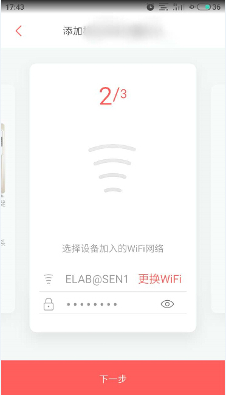

# Light Demo of Joylink

## 一、介绍

`light demo`为客户提供一种简易的智能灯解决方案，客户可根据自己的需要进行二次开发，实现更加更加丰富的控制操作。

## 二、解决方案部署

**1.参考[README](../../README.md)文档进行硬件准备、环境搭建、SDK 准备**

**2.烧录三元组信息**

- 调试使用可通过menuconfig录入`UUID`、`PRIVATE_KEY`、`MAC_ADDRESS`等信息
- 量产使用请参考 [量产说明](../../docs/md/量产说明) 文档烧录三元组 NVS 分区.

> 如果执行了 `make erase_flash`, 需要重新烧录三元组.

**3.配置 `Light Demo`**

- ESP32开发板：RGB 灯默认分别接在 `GPIO25`, `GPIO26`, `GPIO27` 
- ESP32S2开发板：RGB 灯默认分别接在 `GPIO34`, `GPIO35`, `GPIO36` 
- ESP8266开发板：RGB 灯默认分别接在 `GPIO4`, `GPIO5`, `GPIO15` 

>GPIO可通过menuconfig中`Joylink->light_red、light_green、light_blue`进行个性化配置

**4.编译`light_demo`并烧录运行**

对于ESP32平台，请输入如下命令进行编译烧录

```
cd examples/light_demo
idf.py build
idf.py -p /dev/ttyUSBx flash monitor
```

对于ESP32S2平台，请使用如下命令进行编译烧录

```
cd examples/light_demo
idf.py set-target esp32s2
idf.py build
idf.py -p /dev/ttyUSBx flash monitor
```

对于ESP8266平台，请使用如下命令进行编译烧录

```
cd examples/light_demo
make -j8 flash monitor
```

>ESP32平台也可使用make指令，但在将来的esp-idf主要版本中，可能会删除对GNU Make构建系统的支持。

## 三、运行

* 扫描二维码

    
    
* 配网界面

    
    
* 选择合适的AP进行配网（乐鑫设备仅支持 2.4G AP）

* 等待建立连接

    >若连接过程中app未发现设备的softAP，则可根据提示进行手动连接至设备的softAP
    
* 连接服务器成功后用户设备列表中会出现该智能灯设备


* 用户可通过点击开关以及氛围灯对智能灯设备进行控制

    > 开启设备显示白色灯光
    >
    > 开启氛围灯显示紫色灯光

## 四、二次开发

* 用户可通过修改joylink_light.c文件实现更加个性化的智能灯控制

